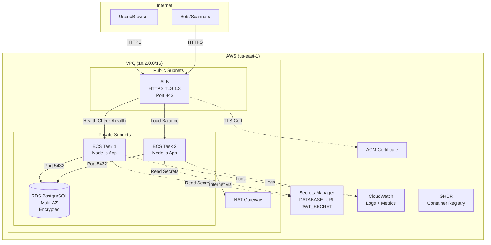
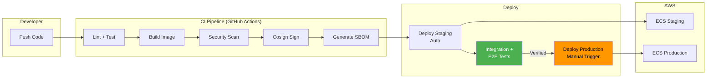
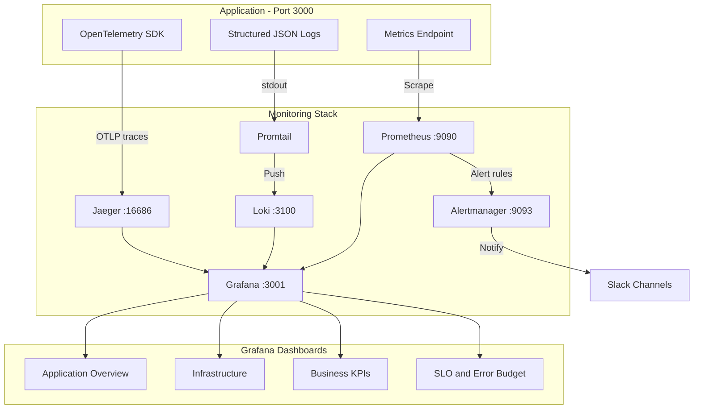

# Church Management System — DevOps Engineering Portfolio


A production-grade church membership management application used as a vehicle to demonstrate senior DevOps/SRE engineering practices. The application itself is simple — the infrastructure, deployment pipeline, observability, and security practices are what matter.

**Live:** https://app.johndesiventures.website

---

## What This Project Demonstrates

| Category | Technologies | What I Built |
|----------|-------------|-------------|
| **Infrastructure as Code** | Terraform, AWS | Multi-environment deployment (dev/staging/prod) with modular Terraform |
| **Containerization** | Docker, GHCR | Multi-stage hardened Dockerfile, automated image builds |
| **CI/CD Pipeline** | GitHub Actions | 7 workflows: CI, deploy-staging, deploy-prod, canary, release, security, infracost |
| **Observability** | OpenTelemetry, Prometheus, Grafana, Loki, Jaeger | Full LGTM stack + CloudWatch production monitoring |
| **Security** | Trivy, Cosign, SBOM, Helmet.js | Supply chain security, image signing, IaC scanning |
| **Reliability** | CodeDeploy, k6, ECS auto-scaling | Canary deployments, load testing, chaos engineering |
| **Kubernetes** | EKS, Helm, ArgoCD, Karpenter | GitOps deployment with intelligent node autoscaling |

---

## Architecture

### Infrastructure (AWS)



### CI/CD Pipeline



### Observability Stack (Local)



---

## Key Achievements

- **Zero-downtime deployments** — Rolling updates with circuit breaker + canary option
- **10-second self-healing** — Killed a production task, ECS replaced it automatically with no user impact
- **Full CI/CD pipeline** — Push to main → auto-deploy to staging → manual promote to production
- **Supply chain security** — Every image is signed (Cosign), has an SBOM, and is vulnerability-scanned
- **SLO-based alerting** — Error budget tracking with burn rate alerts (not just threshold alerts)
- **Infrastructure reproducibility** — `terraform apply` recreates the entire environment in ~10 minutes
- **Multi-environment isolation** — Dev, staging, prod on separate VPCs with separate state files
- **Cost-optimized** — NAT Gateway disabled in dev ($32/month savings), Spot instances for EKS staging

---

## Repository Structure

```
├── .github/workflows/          # 7 CI/CD workflows
├── infrastructure/terraform/
│   ├── modules/                # Reusable: vpc, ecs, rds, alb, secrets, codedeploy, eks
│   └── environments/           # Per-env configs: dev, staging, prod, eks
├── kubernetes/                 # Kustomize base + overlays (dev/staging/prod)
├── helm/church-cms/            # Helm chart with per-env values
├── argocd/                     # GitOps app-of-apps pattern
├── monitoring/                 # Prometheus, Grafana, Loki, Jaeger, Alertmanager configs
├── load-testing/               # k6 scripts (smoke, stress, spike, soak)
├── cypress/                    # E2E browser tests
├── scripts/                    # Integration tests, migration checks
├── docs/                       # Deep-dive guides (see below)
├── lib/                        # App: telemetry, metrics, logger, database, validation
└── server.js                   # Express.js application
```

---

## Documentation

Comprehensive learning guides written during the build process:

| Document | What It Covers |
|----------|---------------|
| [Observability Deep Dive](docs/OBSERVABILITY_DEEP_DIVE.md) | OpenTelemetry, Prometheus, Grafana, Loki, Jaeger — hands-on |
| [IaC & Deployment Strategy](docs/IAC_AND_DEPLOYMENT_DEEP_DIVE.md) | Terraform modules, deployment pipeline architecture |
| [Terraform Deployment Guide](docs/TERRAFORM_DEPLOYMENT_GUIDE.md) | Step-by-step: zero to production on AWS |
| [CloudWatch Production Guide](docs/CLOUDWATCH_PRODUCTION_GUIDE.md) | Production monitoring with AWS CloudWatch |
| [Supply Chain Security](docs/SUPPLY_CHAIN_SECURITY.md) | Cosign, SBOM, Trivy IaC, Dockerfile hardening |
| [Load Testing & Canary](docs/LOAD_TESTING_AND_CANARY.md) | k6 load tests, CodeDeploy blue/green canary |
| [Kubernetes Deep Dive](docs/KUBERNETES_DEEP_DIVE.md) | EKS, Helm, ArgoCD, Karpenter |
| [SLO & Alert Routing](docs/SLO_AND_ALERT_ROUTING.md) | Error budgets, burn rates, Slack alerting |
| [Troubleshooting](docs/TROUBLESHOOTING.md) | Real production issues encountered and resolved |

---

## Tech Stack

**Application:** Node.js 20, Express, PostgreSQL, JWT, bcrypt, Helmet.js

**Infrastructure:** AWS (ECS Fargate, RDS, ALB, ACM, Secrets Manager, CloudWatch, VPC)

**IaC:** Terraform (6 modules, 3 environments, remote S3 backend)

**CI/CD:** GitHub Actions, release-please (semantic versioning), GHCR

**Observability:** OpenTelemetry, Prometheus, Grafana, Loki, Jaeger, Alertmanager, k6

**Security:** Trivy (IaC + image + SBOM), Cosign (image signing), Sigstore, CycloneDX/SPDX

**Kubernetes (branch):** EKS, Helm, Kustomize, ArgoCD, Karpenter, Cilium NetworkPolicies

---

## Quick Start (Local Development)

```bash
git clone https://github.com/bankolejohn/church-idea.git
cd church-idea
cp .env.example .env
cp .env.db.example .env.db
make dev          # App + PostgreSQL
make monitoring   # + Prometheus, Grafana, Loki, Jaeger
make load-smoke   # Run smoke tests
```

---

## Environments

| Environment | URL | Infra |
|-------------|-----|-------|
| Local | http://localhost:3000 | Docker Compose |
| Production | https://app.johndesiventures.website | ECS Fargate + RDS Multi-AZ |

---

## License

MIT
